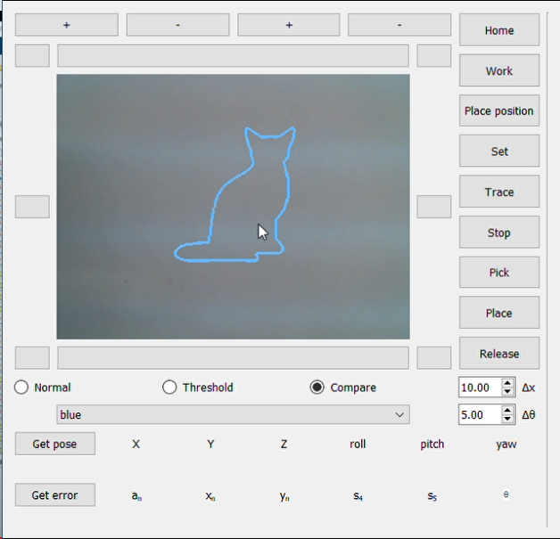

# Control 6-DOF robot using visual servoing with image moments
My HCMUT bachelor gradute thesis apply visual servoing using image moments into control 6-DOF robot

# Installation
* 1 - clone repo 
* 2 - create a virtual environment and activate
*  - pip install virtualenv
*  - virtualenv envname
*  - envname\scripts\activate
* 3 - cd into project 
* 4 - pip install -r requirements.txt
* 5 - python main.py

# Knowledge
* Python, Numpy, PyQT5, OpenCV
* Using PyQT5 to design UI
* Visual servoing algorithms
* Image processing with OpenCV
* TCP/IP
* Simulation with matlab

# Tech Stack
* Python
* Numpy
* PyQT5
* OpenCV

# Demo link 
* Demo with robot: https://www.youtube.com/watch?v=wBHwWFKJg6c
* Simulation: https://www.youtube.com/watch?v=jJAJBk5i3O0

# UI
 

# Simulation

 

# Visual Servoing algorithms
* Imgage moments overview

* Iteraction matrix L using in visual servoing with image moment

# Camera Calibration,Image processing, Robot connect
* Find more details in the document

# Documentation
*  CQ Tran Tien Trung - Control 6-DOF robot using Visual Servoing with image moment.pdf